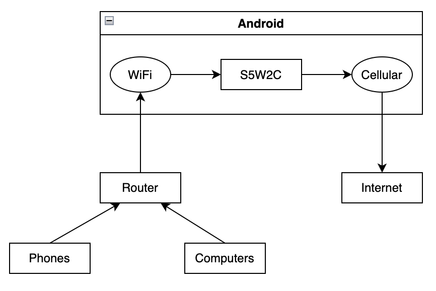
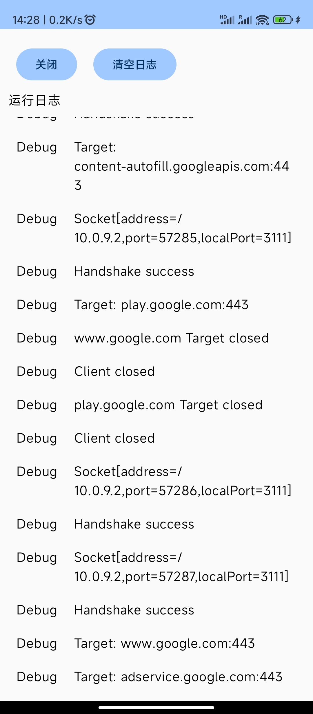

# S5W2C
S5W2C is an Android application as a Socks5 proxy server. It receives requests from LAN clients through WiFi, and forwards them to the targets through mobile data (Cellular).

## Use Case
Some destination addresses or network protocols are forbidden when using WiFi or Ethernet, but available when using mobile data. S5W2C can be used to bypass these limitations in such cases.

## Limitations
1. S5W2C does not support IPv6 target addresses and UDP requests.
2. Tun2socks is not implemented in S5W2C to handle requests from other applications on the device itself. An alternative solution is to use V2rayNG as a Socks5 client.
